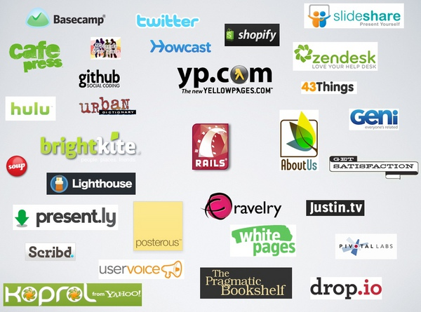
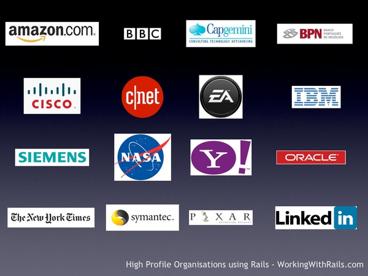

!SLIDE center
# Rails #

!SLIDE center
## Creator ##

## David Heinemeier Hansson (dhh) ##

!SLIDE
# Rails #
### "Ruby on Rails is a full-stack web framework optimized for programmer happiness and sustainable productivity. It encourages beautiful code by favoring convention over configuration" ###

!SLIDE
# Rails #
### Here's the Rails gospel: Promote good ideas and technologies. See Ajax, REST, Atom, testing. Rails is a curated set of tech choices." ###

!SLIDE bullets incremental
# Rails #
* Full Stack Framework
* Agile Development
* CRUD

!SLIDE bullets incremental
## Rails is easy to deploy ##
* Apache/nginx using [Passenger](http://www.modrails.com/)
* [Heroku](http://heroku.com)
* [EngineYard](http://engineyard.com)
* [Google AppEngine](http://code.google.com/appengine/)
* Your favorite Java app server
* Any VPS
* ... etc

!SLIDE center
## Some Rails users ##

!SLIDE center
## ... and more ##

