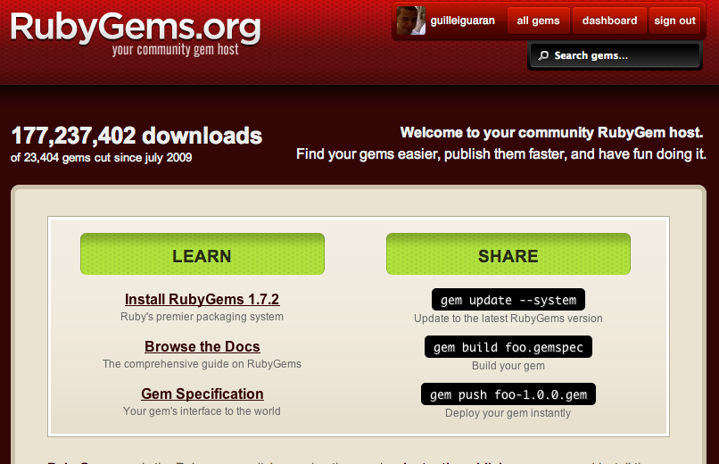

!SLIDE center
# Ruby #

!SLIDE center
## Creator ##

## Yukihiro "Matz" Matsumoto ##

!SLIDE bullets incremental
# 10 things about Ruby #
* Free and open source
* High level programming language
* Cross platform
* Elegant syntax
* Large core and standard library

!SLIDE bullets incremental
# 10 things about Ruby #
* 23,000+ of user contributed libraries
* Multiparadigm
* Big community
* A lot of free traning material
* A lot of books

!SLIDE
## Syntax ##
    @@@ ruby
    5.times { print "Odelay!" }
    exit unless "restaurant".include? "aura"
    foods = ['toast', 'cheese', 'wine']
    foods.each { |food| print food.capitalize }

!SLIDE center
## Try Ruby ##
### [Try Ruby! in your browser](http://tryruby.org/)

!SLIDE bullets incremental
## Core Library ##
* Numbers (Integers, Floats)
* Strings
* Array
* Hashes
* Files
* Regular Expressions
* Time and Dates
* ..., etc

!SLIDE bullets incremental
## Standard Library ##
* Sets
* XML
* CSV
* YAML
* Work with files and paths
* Access system features
* ...

!SLIDE bullets incremental
## Advanced Features ##
* Classes are Open
* Supports Metaprogramming
* You can easily create Domain-Specific Language
* You can pass blocks of code to functions

!SLIDE bullets incremental
# Ruby Gems
* Because not all is in Core and Standard library
* User contributed libraries
* Easy to install: gem install rails

!SLIDE center
## RubyGems.org

