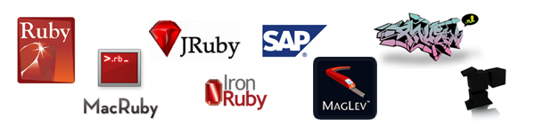

!SLIDE center
# Ruby #

!SLIDE center
## Creator ##

## Yukihiro "Matz" Matsumoto ##

!SLIDE bullets incremental
# 10 things about Ruby #
* Free and open source
* High level programming language
* Cross platform
* Elegant syntax
* Large core and standard library

!SLIDE bullets incremental
# 10 things about Ruby #
* 23,000+ of user contributed libraries
* Multiparadigm
* Big community
* A lot of free traning material
* A lot of books

!SLIDE bullets
# Versions #
* 1.8: former stable version, still widely used in production, still updated
* 1.9: current stable version, recommended for all new projects
* [More info about changes between 1.8 and 1.9](http://slideshow.rubyforge.org/ruby19.html)

!SLIDE center
# Implementations #

!SLIDE center
## MRI (Matz's Ruby Interpreter) ##

### Official Ruby 1.8 implementation written by Matz ###
### Current version: 1.8.7-p334 ###

!SLIDE center
## YARV (Yet Another Ruby VM) ##

### Official 1.9 implementation, written by Koichi Sasada ###
### Current version: 1.9.2-p180 ###

!SLIDE center
## REE (Ruby Enterprise Edition) ##

### Optimized for production server environments ###
### Compatible with Ruby 1.8 ###
### Current version: 1.8.7-2011.03 ###

!SLIDE center
## JRuby ##

### Ruby language running under Java Virtual Machine ###
### Created by Sun Microsystems, now maintained by EngineYard ###
### Java interoperatibility ###
### Compatible with Ruby 1.8 and 1.9 ###
### Current version: 1.6.1 ###

!SLIDE center
## Rubinius ##

### C++, LLVM-powered ###
### Created and maintained by EngineYard ###
### Ruby 1.8 compatible, 1.9 in progress ###
### Current version: 1.2.3 ###

!SLIDE center
## MacRuby ##

### Written on top of Objective-C, Cocoa and friends ###
### Created by Apple ###
### Interoperatibility with OS X Frameworks ###
### Ruby 1.9 compatible ###
### Current version: 0.10 ###

!SLIDE center
## IronRuby ##

### Ruby running under .NET DLR ###
### Created by Microsoft ###
### Ruby 1.8.6 compatible and Ruby 1.9 compatible ###
### Not as mature as the other implementations ###
### Current version: 1.0 ###

!SLIDE
## Syntax ##
    @@@ ruby
    5.times { print "Odelay!" }
    exit unless "restaurant".include? "aura"
    foods = ['toast', 'cheese', 'wine']
    foods.each { |food| print food.capitalize }

!SLIDE center
## Try Ruby ##
### [Try Ruby! in your browser](http://tryruby.org/)

!SLIDE bullets incremental
## Core Library ##
* Numbers (Integers, Floats)
* Strings
* Array
* Hashes
* Files
* Regular Expressions
* Time and Dates
* ..., etc

!SLIDE bullets incremental
## Standard Library ##
* Sets
* XML
* CSV
* YAML
* Work with files and paths
* Access system features
* ...

!SLIDE bullets incremental
## Advanced Features ##
* Classes are Open
* Supports Metaprogramming
* You can easily create Domain-Specific Language
* You can pass blocks of code to functions

!SLIDE bullets incremental
# Ruby Gems
* Because not all is in Core and Standard library
* User contributed libraries
* Easy to install: gem install rails

!SLIDE center
## RubyGems.org

